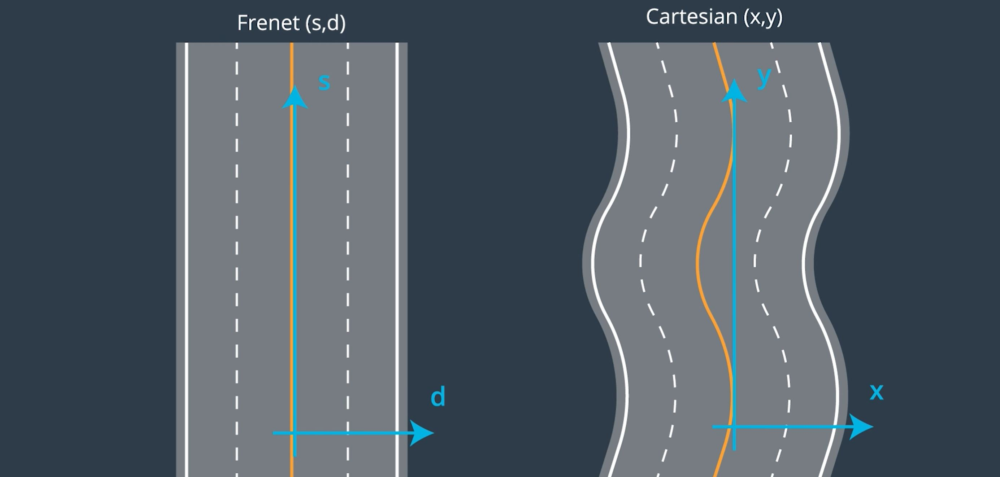

# Highway-Driving
Path planning algorithm to safely navigate a vehicle around highway while changing lanes and limiting acceleration and jerk.
   


Highway driving is a topic of high interest in the self driving cars era. Driving long distance is time consuming and highway accidents are common due to fatigue and lane drifting. Premium car manufactures and trucking companies are heavily involved in implementing autonomous highway driving solutions.

In this project I implemented a path planning algorithm that drives a vehicle autonomously around a simulated highway track. The goal is to drive as close as possibe to the 50 MPH speed limit and to guarantee the passengers comfort by limiting the jerk value. The algorithm optimizies the vehicle's average speed by changing lanes when behind a slower vehicle, and checks for another faster available lane.

This project is implemented in C++ the source code can be found in the *src* folder above. The path planning logic is implemented in main.cpp under h.onMessage function.
The starting code for this project is provided by Udacity and can be found [here](https://github.com/udacity/CarND-Path-Planning-Project).


## The Highway Map, Frenet v.s Cartesian Coordinates

In path planning, the goal is to tell the car where to move next and to generate its trajectory. To drive smoothly along the road, the trajectory needs to be along the center of the lane and take into account the road's curvature.
The road geometry can induce some particularly complicated math when computing the trajectory in [cartesian](https://en.wikipedia.org/wiki/Cartesian_coordinate_system) coordinates.



This created the need for a simplified coordinate system called [Frenet](https://en.wikipedia.org/wiki/Frenet%E2%80%93Serret_formulas)

In the Frenet approach, it is implied that the geometry of the road is already known through a detailed map. In this case it is much easier to work using the s value which moves along with the road and the d value which indicates the displacement from the center of the road.

For this project the map is provided in *highway_map.csv* file under the *data* folder, in the following format:
```
784.6001 1135.571 0 -0.02359831 -0.9997216
815.2679 1134.93 30.6744785308838 -0.01099479 -0.9999396
844.6398 1134.911 60.0463714599609 -0.002048373 -0.9999979
875.0436 1134.808 90.4504146575928 -0.001847863 -0.9999983
905.283 1134.799 120.689735412598 0.004131136 -0.9999915
934.9677 1135.055 150.375551223755 0.05904382 -0.9982554
```

The above are points along the yellow line marking the center of the road. The first two columns represent the *(x,y)* position of the map points. In the third column, the *s* value is given. The *s* value starts with 0 and goes around the road in increments of about 30 meters. The track is a loop of about 7 km.
The last two columns give the *d* value as a unit normal vector perpendicular to the road in the direction of the right-hand side (split up into the x component, and the y component).
The d vector in this form is easily used to calculate lane positions. *d* is then multiplied by the lane width of 4 meters and the desired position in the lane.


## Traffic Analysis

Once trajectories can be generated along the road, the next challenge is to avoid collision with other vehicles and to generate trajectories to pass them if possible.

Sensor Fusion object list is provided with the following data: 
- car's unique ID, 
- car's x position in map coordinates, 
- car's y position in map coordinates, 
- car's x velocity in m/s, 
- car's y velocity in m/s, 
- car's s position in frenet coordinates, 
- car's d position in frenet coordinates.

To avoid rear end collision, all cars from sensor fusion are checked to determine if there is any in the same lane as ego car. If a slower front car is identyfied, than the ego car shall match the car's speed.

```
// loop over all detected cars from sensor fusion
          for (int i = 0; i < sensor_fusion.size(); ++i){
            // check if the car's d Frenet is within the boundaries of my lane
            if ( ( lane_id*lane_width < sensor_fusion[i][6]) &&  
                 (sensor_fusion[i][6] < (lane_id+1)*lane_width) ){
              // check if the car is in fromt of me, closer than the end of my previous path plus safety distance               
              if ((sensor_fusion[i][5] < (end_path_s + safety_dist)) && 
                  (sensor_fusion[i][5] > (car_s - 5.0))                 ){           
                // calculate other's car absolute speed value in m/s              
                front_car_speed = std::sqrt( pow(sensor_fusion[i][3],2.0) + pow(sensor_fusion[i][4],2.0) ); 
                // calculate the diference in speed between the two cars
                delta_speed = car_speed - front_car_speed;
                // if car going slower than me, match its speed
                if (delta_speed > 0.0){
                  ref_speed = front_car_speed;
                  front_car_slower = 1;
                  //std::cout<<"CAR IN MY LANE GOING SLOWER!!!"<<std::endl;
                } 
              }
            }
          }
```

In case the ego car is driving behind a slower vehicle, the possibility of a lane change is evaluated. For example, for a left lane change there needs to be a gap in traffic in the left lane of at least 10 meters ahead of ego car and another 10 meters behind it. Checking for this gap assures the ego car won't colide laterraly into another vehicle driving by its side and also that it won't cut too short in front of another vehicle.

```
// check for cars at my left in the eventuality of a lane change to the left
            // make sure car is not in the left most lane
            if ( (lane_id > 0) &&
                 ((lane_id - 1) * lane_width < sensor_fusion[i][6]) &&  
                 (sensor_fusion[i][6] < lane_id * lane_width)         ){
              // look for available space in the left lane
              if ( (sensor_fusion[i][5] < car_s + 10.0) && 
                   (sensor_fusion[i][5] > car_s - 10.0)   ){       
                left_clear = 0;
              }
            }
```

Finally the lane change decision is made when if driving behind a slower vehicle, there is room to change lanes either to the left or to the right lane and the traffic in the destination lane is moving faster. There is no need to get behind a slower vehicle in another lane.

```
// if the car in front of me slowed me down too much, change lanes if a lane chane is not already in progress
          if ( (front_car_slower == 1) && 
               (car_speed < 0.9 * max_speed) &&
               (change_lane == 0)               ) {
            change_lane = 1;
          }
          
          if (change_lane == 1){
            //try to change lanes to the left
            if ( (lane_id > 0) && 
                 (left_clear == 1) &&
                 (speed_per_lane[lane_id - 1] > car_speed + speed_hyst) ){
              lane_id = lane_id - 1;
              change_lane = 0;
            }else if ( (lane_id < 2) && 
                       (right_clear == 1) &&
                       (speed_per_lane[lane_id + 1] > car_speed + speed_hyst) ){
              lane_id = lane_id + 1;
              change_lane = 0;
            }        
          }
```

## Path Planning Model

