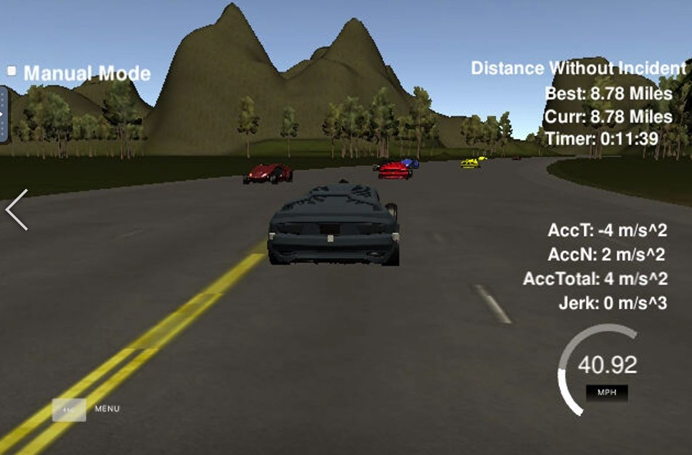

# Highway-Driving
Path planning algorithm to safely navigate a vehicle around highway while changing lanes and limiting acceleration and jerk.
   

Highway driving is a topic of high interest in the self driving cars era. Driving long distance is time consuming and highway accidents are common due to fatigue and lane drifting. Premium car manufactures and trucking companies devote a lot of resources in implementing and perfecting autonomous highway driving solutions.

In this project I implemented a path planning algorithm that drives a vehicle autonomously around a highway track. The algorithm optimizies the vehicle's average speed by changing lanes when behind slower vehicles and checking which is the fastest available lane.

